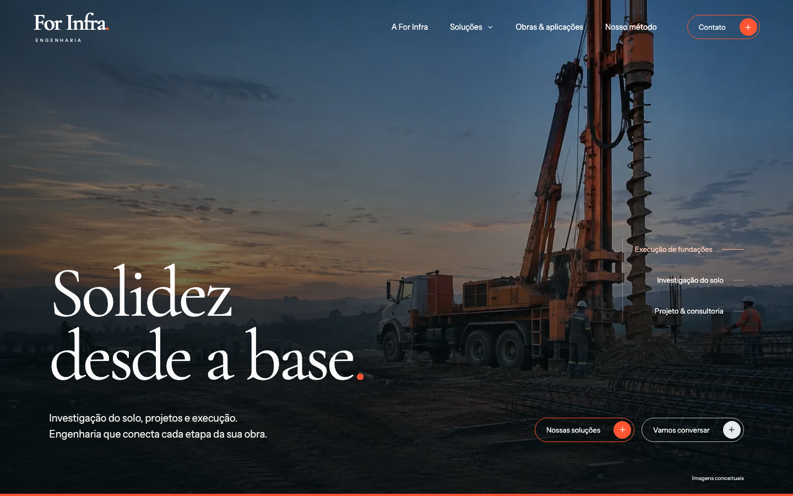

# For Infra Engenharia

Site institucional da For Infra Engenharia, preparado para revisão de desenvolvimento e design. Desenvolvido com Next.js 15, React 19 e TypeScript, com exportação estática.

**Ver o site:** [For Infra Engenharia — prévia pública](https://thalesmsousa10.github.io/for-infra-engenharia/).

## Rodar o projeto

Requisitos: Node.js 22 e npm.

```sh
npm ci
npm run dev
```

Abra http://127.0.0.1:3000/. Se essa porta já estiver ocupada, use:

```sh
npm exec next dev -- --hostname 127.0.0.1 --port 3001
```

## Conferir a versão de produção

```sh
npm run build
```

O build valida TypeScript e gera o site em `out/`. Para conferir essa exportação, com Python 3 instalado:

```sh
python3 -m http.server 3001 --bind 127.0.0.1 --directory out
```

Abra http://127.0.0.1:3001/. O projeto exportado não usa `next start`. A hospedagem definitiva precisa servir diretórios com `index.html` e configurar sua página 404.

## Páginas

| Página | Rota |
|---|---|
| Início | `/` |
| A For Infra | `/sobre/` |
| Obras e aplicações | `/obras/` |
| Soluções | `/solucoes/` |
| Contato | `/contato/` |
| Consultoria | `/solucoes/consultoria/` |
| Projetos de fundações | `/solucoes/projetos-de-fundacoes/` |
| Sondagem SPT | `/solucoes/sondagem-spt/` |
| Estacas escavadas | `/solucoes/estacas-escavadas/` |
| Estacas Strauss | `/solucoes/estacas-strauss/` |

O modelo de caso está salvo em `modelos/obra/ModeloDeCaso.tsx`, fora das rotas públicas. `/obras/modelo/` foi retirada da exportação. O componente `CaseStudy` permanece disponível para cadastrar um caso real documentado e autorizado.

## Para quem vai revisar

Confira o [guia de revisão](docs/REVISAO.md) e a [auditoria técnica](docs/AUDITORIA.md). Sugestões podem ser registradas nas Issues do repositório, preferencialmente com página, largura da tela, captura e proposta de ajuste.

A entrega de 30/09 está documentada em [publicação e compartilhamento](docs/LANCAMENTO-GITHUB.md), com medições feitas no endereço público.



| Início no celular | Página Sobre |
|---|---|
|  |  |

## Organização

- `app/`: páginas, layout, metadados e CSS compartilhado.
- `components/`: cabeçalho, rodapé, apresentação editorial, serviços e formulário.
- `lib/content.ts`: serviços, aplicações e WhatsApp comercial.
- `lib/service-pages.ts`: conteúdo das cinco páginas de serviços.
- `lib/editorial-images.ts`: imagens exclusivas das páginas internas e textos alternativos.
- `lib/images.ts`: variantes responsivas do acervo.
- `lib/metadata.ts`: títulos, descrições, canonical e cartões de compartilhamento.
- `lib/fonts.ts`: fontes locais descobertas no HTML, com preload dos subconjuntos principais no layout.
- `modelos/`: modelos de trabalho fora da navegação e da exportação pública.
- `public/`: imagens, fontes locais e bibliotecas de animação.

O estilo aprovado combina petróleo e laranja com Cormorant Garamond e Instrument Sans. GSAP/ScrollTrigger são locais e o movimento respeita `prefers-reduced-motion`. As fotografias são conceituais, geradas por IA, e não representam obras ou integrantes reais da empresa. As fontes incluem suas licenças em `public/fonts/`.

As imagens da home foram preservadas. O acervo interno inclui 19 imagens distintas em WebP: 17 nas páginas comerciais e duas reservadas ao modelo de caso arquivado. Confira o [mapeamento do acervo](docs/assets/PLANO-DE-IMAGENS.md).

O cartão de compartilhamento usa a arte `public/assets/for-infra-compartilhamento-v1.png` (1200 × 630), com fonte editável em `docs/assets/compartilhamento.html`. As páginas comerciais têm Open Graph e Twitter Cards com título, descrição e URL próprios. A exibição de prévias depende do serviço que recebe o link e do cache dele.

## Formulário e lançamento

O formulário valida os dados, apresenta uma revisão e prepara uma mensagem para o WhatsApp comercial. O visitante conclui o envio no WhatsApp. Não há backend de contatos, envio automático, armazenamento de leads nem geração automática de orçamento.

A versão está em revisão: `noindex` permanece ativo. Domínio definitivo, indexação, metadados de compartilhamento, compressão e cache devem ser configurados antes do lançamento.

## Publicação no GitHub Pages

O workflow `.github/workflows/pages.yml` gera o site com `npm ci` e `npm run build`, publica somente a pasta `out/` e atualiza a prévia a cada push na `main`. Em Settings → Pages, a origem deve ser **GitHub Actions**. Publicar a raiz da branch transforma o README em uma página de documentação, em vez de publicar o site.

O workflow define `NEXT_PUBLIC_BASE_PATH` e `NEXT_PUBLIC_SITE_URL` a partir dos dados do Pages. Links do Next.js e arquivos públicos recebem o prefixo do repositório; fontes são incluídas pelo build. Sem essas variáveis, o desenvolvimento local continua na raiz `/`.

Este repositório está preparado para avaliação e não inclui uma licença de código aberto. Dependências e fontes mantêm suas próprias licenças.
